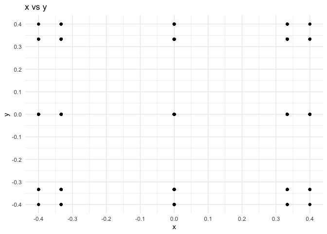
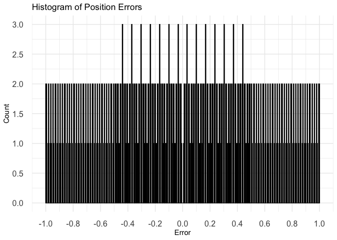
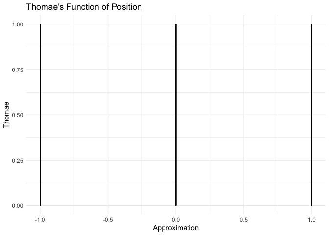

brocot
================

    ## ℹ Loading brocot


`brocot` is an R package for exploring physics with coprime fractions.

## Position vs Momentum

<!-- -->

## Position

    ## `stat_bin()` using `bins = 30`. Pick better value with `binwidth`.

<!-- --><!-- --><!-- -->

    ## `stat_bin()` using `bins = 30`. Pick better value with `binwidth`.

<!-- --><!-- -->

## Momentum

    ## `stat_bin()` using `bins = 30`. Pick better value with `binwidth`.

<!-- --><!-- --><!-- -->

    ## `stat_bin()` using `bins = 30`. Pick better value with `binwidth`.

<!-- --><!-- -->

## From Position to Momentum to Position

``` r
num_samples  = 5
num_bins     = 5
slit_width   = 17

dx           = slit_width/num_samples
min_x        = -slit_width / 2 + dx
max_x        =  slit_width / 2 - dx
x_real       = seq(from=min_x, to=max_x, by=dx)
sigma_x_lt   = x_real - min_x + dx
sigma_x_gt   = max_x - x_real + dx
x = coprimer::nearby_coprime(x_real, sigma_x_lt, sigma_x_gt)
print(x)
```

    ##   num den approximation    x error thomae euclids_orchard_height depth   path
    ## 1  -6   1            -6 -5.1  -0.9      1              0.1428571     6 LLLLLL
    ## 2  -2   1            -2 -1.7  -0.3      1              0.3333333     2     LL
    ## 3   2   1             2  1.7   0.3      1              0.3333333     2     RR
    ## 4   6   1             6  5.1   0.9      1              0.1428571     6 RRRRRR
    ##   lower_uncertainty upper_uncertainty valid_min valid_max
    ## 1               3.4              13.6      -8.5       8.5
    ## 2               6.8              10.2      -8.5       8.5
    ## 3              10.2               6.8      -8.5       8.5
    ## 4              13.6               3.4      -8.5       8.5

``` r
sigma_p_lt   = 1 / sigma_x_lt
sigma_p_gt   = 1 / sigma_x_gt
p_real       = sigma_p_gt - sigma_p_lt
p = coprimer::nearby_coprime(p_real, sigma_p_lt, sigma_p_gt)
print(p)
```

    ##   num den approximation           x       error thomae euclids_orchard_height
    ## 1  -1   5          -0.2 -0.22058824  0.02058824    0.2              0.1666667
    ## 2   0   1           0.0 -0.04901961  0.04901961    1.0              1.0000000
    ## 3   0   1           0.0  0.04901961 -0.04901961    1.0              1.0000000
    ## 4   1   5           0.2  0.22058824 -0.02058824    0.2              0.1666667
    ##   depth  path lower_uncertainty upper_uncertainty   valid_min   valid_max
    ## 1     5 LRRRR        0.29411765        0.07352941 -0.51470588 -0.14705882
    ## 2     0              0.14705882        0.09803922 -0.19607843  0.04901961
    ## 3     0              0.09803922        0.14705882 -0.04901961  0.19607843
    ## 4     5 RLLLL        0.07352941        0.29411765  0.14705882  0.51470588

``` r
sigma_x_conj_lt = 1 / sigma_p_lt
sigma_x_conj_gt = 1 / sigma_p_gt
x_conj_real     = (sigma_x_conj_lt - sigma_x_conj_gt) / 2
x_conj          = coprimer::nearby_coprime(x_conj_real, sigma_x_conj_lt, sigma_x_conj_gt)
print(x_conj)
```

    ##   num den approximation    x error thomae euclids_orchard_height depth   path
    ## 1  -6   1            -6 -5.1  -0.9      1              0.1428571     6 LLLLLL
    ## 2  -2   1            -2 -1.7  -0.3      1              0.3333333     2     LL
    ## 3   2   1             2  1.7   0.3      1              0.3333333     2     RR
    ## 4   6   1             6  5.1   0.9      1              0.1428571     6 RRRRRR
    ##   lower_uncertainty upper_uncertainty valid_min valid_max
    ## 1               3.4              13.6      -8.5       8.5
    ## 2               6.8              10.2      -8.5       8.5
    ## 3              10.2               6.8      -8.5       8.5
    ## 4              13.6               3.4      -8.5       8.5

``` r
print(x == x_conj)
```

    ##       num  den approximation    x error thomae euclids_orchard_height depth
    ## [1,] TRUE TRUE          TRUE TRUE  TRUE   TRUE                   TRUE  TRUE
    ## [2,] TRUE TRUE          TRUE TRUE  TRUE   TRUE                   TRUE  TRUE
    ## [3,] TRUE TRUE          TRUE TRUE  TRUE   TRUE                   TRUE  TRUE
    ## [4,] TRUE TRUE          TRUE TRUE  TRUE   TRUE                   TRUE  TRUE
    ##      path lower_uncertainty upper_uncertainty valid_min valid_max
    ## [1,] TRUE              TRUE              TRUE      TRUE      TRUE
    ## [2,] TRUE              TRUE              TRUE      TRUE      TRUE
    ## [3,] TRUE              TRUE              TRUE      TRUE      TRUE
    ## [4,] TRUE              TRUE              TRUE      TRUE      TRUE
