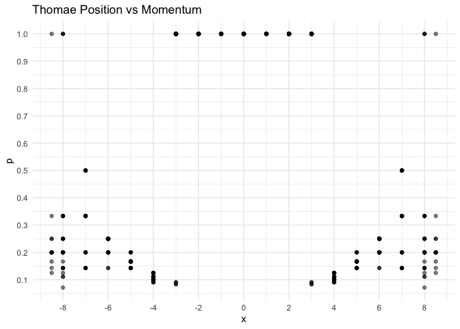
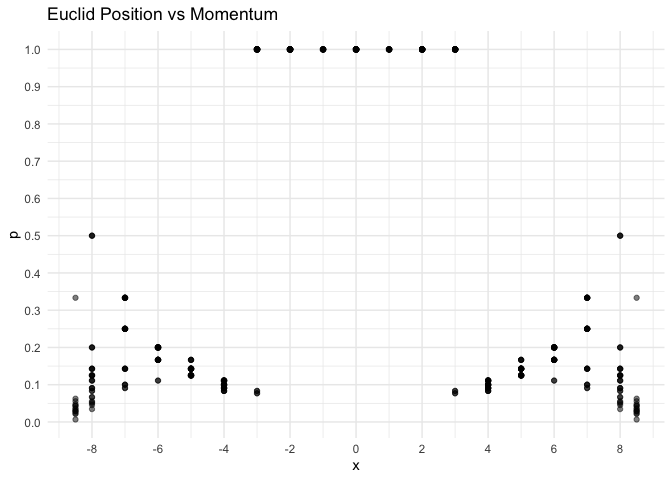
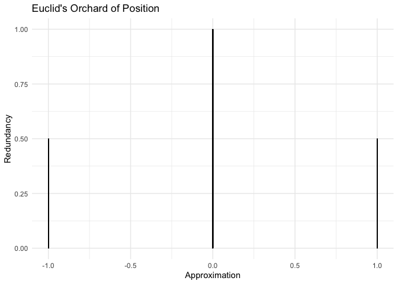

brocot
================

    ## ℹ Loading brocot

`brocot` is an R package for exploring physics with coprime fractions.

## Position vs Momentum

## Position vs Momentum

<!-- --><!-- --><!-- -->

## Position

<!-- --><!-- --><!-- --><!-- --><!-- -->

## Momentum

<!-- --><!-- --><!-- --><!-- --><!-- -->
