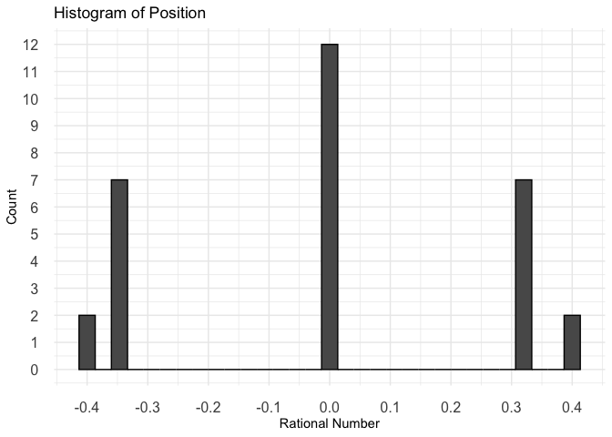
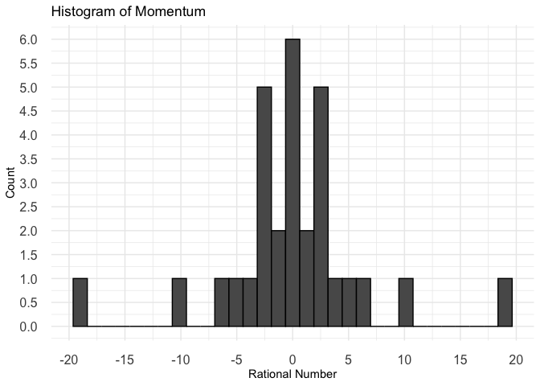
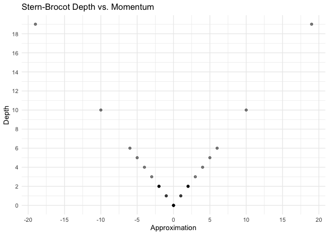

brocot
================

    ## ℹ Loading brocot


`brocot` is an R package for exploring physics with coprime fractions.

## Slit x vs y

<!-- -->

## Screen x vs y

<!-- -->

## Position vs Momentum

<!-- -->

## Position

<!-- --><!-- --><!-- --><!-- --><!-- -->

## Momentum

<!-- --><!-- --><!-- --><!-- --><!-- -->

## From Position to Momentum to Position

``` r
num_per_dim  = 5
num_bins     = 5
slit_width   = 17

dx           = slit_width/num_per_dim
min_x        = -slit_width / 2 + dx
max_x        =  slit_width / 2 - dx
x_real       = seq(from=min_x, to=max_x, by=dx)
lhd_x   = x_real - min_x + dx
rhd_x   = max_x - x_real + dx
x = coprimer::nearby_coprime(x_real, lhd_x, rhd_x)
print(x)
```

    ##   num den approximation    x error thomae euclids_orchard_height depth   path
    ## 1  -6   1            -6 -5.1  -0.9      1              0.1428571     6 LLLLLL
    ## 2  -2   1            -2 -1.7  -0.3      1              0.3333333     2     LL
    ## 3   2   1             2  1.7   0.3      1              0.3333333     2     RR
    ## 4   6   1             6  5.1   0.9      1              0.1428571     6 RRRRRR
    ##   lower_uncertainty upper_uncertainty valid_min valid_max
    ## 1               3.4              13.6      -8.5       8.5
    ## 2               6.8              10.2      -8.5       8.5
    ## 3              10.2               6.8      -8.5       8.5
    ## 4              13.6               3.4      -8.5       8.5

``` r
lhd_p   = 1 / lhd_x
rhd_p   = 1 / rhd_x
p_real  = lhd_p - rhd_p
p = coprimer::nearby_coprime(p_real, lhd_p, rhd_p)
print(p)
```

    ##   num den approximation           x       error thomae euclids_orchard_height
    ## 1   1   4          0.25  0.22058824  0.02941176   0.25                    0.2
    ## 2   0   1          0.00  0.04901961 -0.04901961   1.00                    1.0
    ## 3   0   1          0.00 -0.04901961  0.04901961   1.00                    1.0
    ## 4  -1   4         -0.25 -0.22058824 -0.02941176   0.25                    0.2
    ##   depth path lower_uncertainty upper_uncertainty   valid_min  valid_max
    ## 1     4 RLLL        0.29411765        0.07352941 -0.07352941 0.29411765
    ## 2     0             0.14705882        0.09803922 -0.09803922 0.14705882
    ## 3     0             0.09803922        0.14705882 -0.14705882 0.09803922
    ## 4     4 LRRR        0.07352941        0.29411765 -0.29411765 0.07352941

``` r
lhd_x_conj  = 1 / lhd_p
rhd_x_conj  = 1 / rhd_p
x_conj_real = (lhd_x_conj - rhd_x_conj) / 2
x_conj      = coprimer::nearby_coprime(x_conj_real, lhd_x_conj, rhd_x_conj)
print(x_conj)
```

    ##   num den approximation    x error thomae euclids_orchard_height depth   path
    ## 1  -6   1            -6 -5.1  -0.9      1              0.1428571     6 LLLLLL
    ## 2  -2   1            -2 -1.7  -0.3      1              0.3333333     2     LL
    ## 3   2   1             2  1.7   0.3      1              0.3333333     2     RR
    ## 4   6   1             6  5.1   0.9      1              0.1428571     6 RRRRRR
    ##   lower_uncertainty upper_uncertainty valid_min valid_max
    ## 1               3.4              13.6      -8.5       8.5
    ## 2               6.8              10.2      -8.5       8.5
    ## 3              10.2               6.8      -8.5       8.5
    ## 4              13.6               3.4      -8.5       8.5

``` r
print(x == x_conj)
```

    ##       num  den approximation    x error thomae euclids_orchard_height depth
    ## [1,] TRUE TRUE          TRUE TRUE  TRUE   TRUE                   TRUE  TRUE
    ## [2,] TRUE TRUE          TRUE TRUE  TRUE   TRUE                   TRUE  TRUE
    ## [3,] TRUE TRUE          TRUE TRUE  TRUE   TRUE                   TRUE  TRUE
    ## [4,] TRUE TRUE          TRUE TRUE  TRUE   TRUE                   TRUE  TRUE
    ##      path lower_uncertainty upper_uncertainty valid_min valid_max
    ## [1,] TRUE              TRUE              TRUE      TRUE      TRUE
    ## [2,] TRUE              TRUE              TRUE      TRUE      TRUE
    ## [3,] TRUE              TRUE              TRUE      TRUE      TRUE
    ## [4,] TRUE              TRUE              TRUE      TRUE      TRUE
