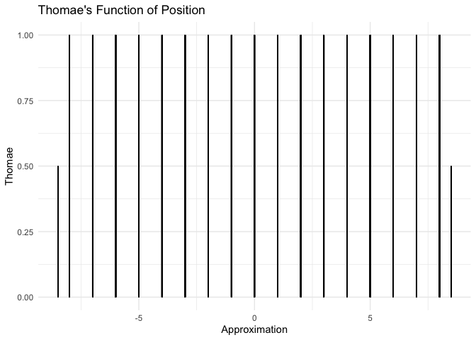
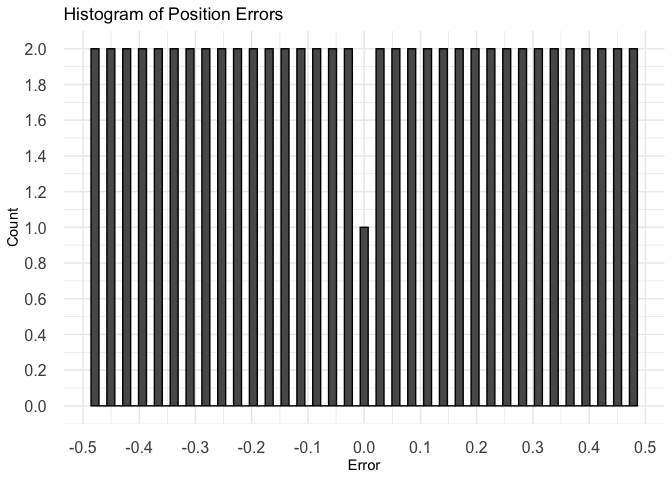

brocot
================

    ## ℹ Loading brocot


`brocot` is an R package for exploring physics with coprime fractions.

# Quantization using rational numbers and Heisenberg uncertainty

There has never been an experimental result in physics given with
irrational numbers, which are infinite idealizations. Furthermore,
experimental quantum physics has given results that are integers and
rational fractions. Our approach in this model is to assert that the
ontological actual values of physics are confined to rational numbers
and that real values are epistemological approximations limited by the
Heisenberg uncertainty principle.

Below, we will demonstrate that particle observations when mapped from
real numbers to rational numbers using the Stern-Brocot tree bounded by
Heisenberg uncertainty yields distributions that are experimentally
indistinguishable from the distributions given by the traditional
wavefunctions. This model does not introduce probability distributions
or hidden variables. Instead, quantum phenomena emerge from the
inherently discrete yet dense nature of the rational numbers.

## Heisenberg Uncertainty

$\Delta \tilde{x} \Delta \tilde{p} \ge \frac{\hbar}{2}$

### Boundary conditions

Boundary conditions at the quantum scale are modeled with split
uncertainties. For example, in the two slit experiment, a particle’s
epistemological approximation is given as $\tilde{x}$. The distance
between the particle and the left side of the slit would be given as
$\Delta \tilde{x}_< =  |\tilde{x}_{left} - \tilde{x}|$ and the distance
between the particle and the right side of the slit would be given as
$\Delta \tilde{x}_> =  |\tilde{x}_{right} - \tilde{x}|$.

$\Delta \tilde{x} = \Delta \tilde{x}_< + \Delta \tilde{x}_> \quad \Delta \tilde{p} = \Delta \tilde{p}_< + \Delta \tilde{p}_>$

$\tilde{x} - \Delta \tilde{x}_< \lt \tilde{x} \lt \tilde{x} + \Delta \tilde{x}_> \quad \tilde{p} - \Delta \tilde{p}_< \lt \tilde{p} \lt \tilde{p} + \Delta \tilde{p}_>$

## Stern-Brocot Heisenberg Quantizer

The Stern-Brocot tree maps from real, epistemological approximates
$\tilde{x}, \tilde{p}$ to rational, ontological actuals $x, p$.

$x = \operatorname{Q}(\Delta \tilde{x}_<, \tilde{x}, \Delta \tilde{x}_>) \quad p = \operatorname{Q}(\Delta \tilde{p}_<, \tilde{p}, \Delta \tilde{p}_>)$

$x,p \in \mathbb{Q}_\perp \quad \tilde{x}, \tilde{p} \in \mathbb{R}$

$\mathbb{Q}_\perp = \left\{ \frac{a}{b} \in \mathbb{Q} \mid a \perp b \iff \gcd(a, b) = 1, a \in \mathbb{Z}, b \in \mathbb{N} \right\}$

$x = \operatorname{Q}(\Delta \tilde{x}_<, \tilde{x}, \Delta \tilde{x}_>)$

$x = \arg\min_{x' \in \{x_<, x_>\}} |\tilde{x} - x'|$

$x_< = \operatorname{SB}(\Delta \tilde{x}_<, \tilde{x}, 0), \quad x_> = \operatorname{SB}(0, \tilde{x}, \Delta \tilde{x}_>)$

### Thomae’s Function

The likelihood that a particle within the slit is at position $x$ is
approximated by Thomae’s function:

$f(x) = \begin{cases} \frac{1}{b}, & \text{if } x = \frac{a}{b}, a \perp b \\ 0, & \text{if } x \text{ is irrational} \end{cases}$

Computational simulations show the same wavelike results as physical one
and two slit experiments.

## The relationship between position and momentum

$\Delta \tilde{x} \ge \frac{\hbar}{2 \Delta \tilde{p}} \quad \Delta \tilde{p} \ge \frac{\hbar}{2 \Delta \tilde{x}}$

$\Delta \tilde{p}_< = \frac{\hbar}{2 \Delta \tilde{x}_<} \quad \Delta \tilde{p}_> = \frac{\hbar}{2 \Delta \tilde{x}_>}$

$d\tilde{p} = \Delta \tilde{p}_> - \Delta \tilde{p}_<$

$\tilde{p} = \tilde{p_0} + d \tilde{p}$

$\Delta \tilde{x}_< = \frac{\hbar}{2 \Delta \tilde{p}_<} \quad \Delta \tilde{x}_> = \frac{\hbar}{2 \Delta \tilde{p}_>}$

$d\tilde{x} = \frac{\Delta \tilde{x}_< + \Delta \tilde{x}_>}{2}$

$\tilde{x} = \tilde{x_0} + d \tilde{x}$

## Position vs Momentum

<!-- -->

## Position

<!-- --><!-- --><!-- --><!-- --><!-- -->

## Momentum

<!-- --><!-- --><!-- --><!-- --><!-- -->

## From Position to Momentum to Position

``` r
num_samples  = 5
num_bins     = 5
slit_width   = 17

dx           = slit_width/num_samples
min_x        = -slit_width / 2 + dx
max_x        =  slit_width / 2 - dx
x_real       = seq(from=min_x, to=max_x, by=dx)
sigma_x_lt   = x_real - min_x + dx
sigma_x_gt   = max_x - x_real + dx
x = coprimer::nearby_coprime(x_real, sigma_x_lt, sigma_x_gt)
print(x)
```

    ##   num den approximation    x error thomae euclids_orchard_height depth   path
    ## 1  -6   1            -6 -5.1  -0.9      1              0.1428571     6 LLLLLL
    ## 2  -2   1            -2 -1.7  -0.3      1              0.3333333     2     LL
    ## 3   2   1             2  1.7   0.3      1              0.3333333     2     RR
    ## 4   6   1             6  5.1   0.9      1              0.1428571     6 RRRRRR
    ##   lower_uncertainty upper_uncertainty valid_min valid_max
    ## 1               3.4              13.6      -8.5       8.5
    ## 2               6.8              10.2      -8.5       8.5
    ## 3              10.2               6.8      -8.5       8.5
    ## 4              13.6               3.4      -8.5       8.5

``` r
sigma_p_lt   = 1 / sigma_x_lt
sigma_p_gt   = 1 / sigma_x_gt
p_real       = sigma_p_gt - sigma_p_lt
p = coprimer::nearby_coprime(p_real, sigma_p_lt, sigma_p_gt)
print(p)
```

    ##   num den approximation           x       error thomae euclids_orchard_height
    ## 1  -1   5          -0.2 -0.22058824  0.02058824    0.2              0.1666667
    ## 2   0   1           0.0 -0.04901961  0.04901961    1.0              1.0000000
    ## 3   0   1           0.0  0.04901961 -0.04901961    1.0              1.0000000
    ## 4   1   5           0.2  0.22058824 -0.02058824    0.2              0.1666667
    ##   depth  path lower_uncertainty upper_uncertainty   valid_min   valid_max
    ## 1     5 LRRRR        0.29411765        0.07352941 -0.51470588 -0.14705882
    ## 2     0              0.14705882        0.09803922 -0.19607843  0.04901961
    ## 3     0              0.09803922        0.14705882 -0.04901961  0.19607843
    ## 4     5 RLLLL        0.07352941        0.29411765  0.14705882  0.51470588

``` r
sigma_x_conj_lt = 1 / sigma_p_lt
sigma_x_conj_gt = 1 / sigma_p_gt
x_conj_real     = (sigma_x_conj_lt - sigma_x_conj_gt) / 2
x_conj          = coprimer::nearby_coprime(x_conj_real, sigma_x_conj_lt, sigma_x_conj_gt)
print(x_conj)
```

    ##   num den approximation    x error thomae euclids_orchard_height depth   path
    ## 1  -6   1            -6 -5.1  -0.9      1              0.1428571     6 LLLLLL
    ## 2  -2   1            -2 -1.7  -0.3      1              0.3333333     2     LL
    ## 3   2   1             2  1.7   0.3      1              0.3333333     2     RR
    ## 4   6   1             6  5.1   0.9      1              0.1428571     6 RRRRRR
    ##   lower_uncertainty upper_uncertainty valid_min valid_max
    ## 1               3.4              13.6      -8.5       8.5
    ## 2               6.8              10.2      -8.5       8.5
    ## 3              10.2               6.8      -8.5       8.5
    ## 4              13.6               3.4      -8.5       8.5

``` r
print(x == x_conj)
```

    ##       num  den approximation    x error thomae euclids_orchard_height depth
    ## [1,] TRUE TRUE          TRUE TRUE  TRUE   TRUE                   TRUE  TRUE
    ## [2,] TRUE TRUE          TRUE TRUE  TRUE   TRUE                   TRUE  TRUE
    ## [3,] TRUE TRUE          TRUE TRUE  TRUE   TRUE                   TRUE  TRUE
    ## [4,] TRUE TRUE          TRUE TRUE  TRUE   TRUE                   TRUE  TRUE
    ##      path lower_uncertainty upper_uncertainty valid_min valid_max
    ## [1,] TRUE              TRUE              TRUE      TRUE      TRUE
    ## [2,] TRUE              TRUE              TRUE      TRUE      TRUE
    ## [3,] TRUE              TRUE              TRUE      TRUE      TRUE
    ## [4,] TRUE              TRUE              TRUE      TRUE      TRUE
